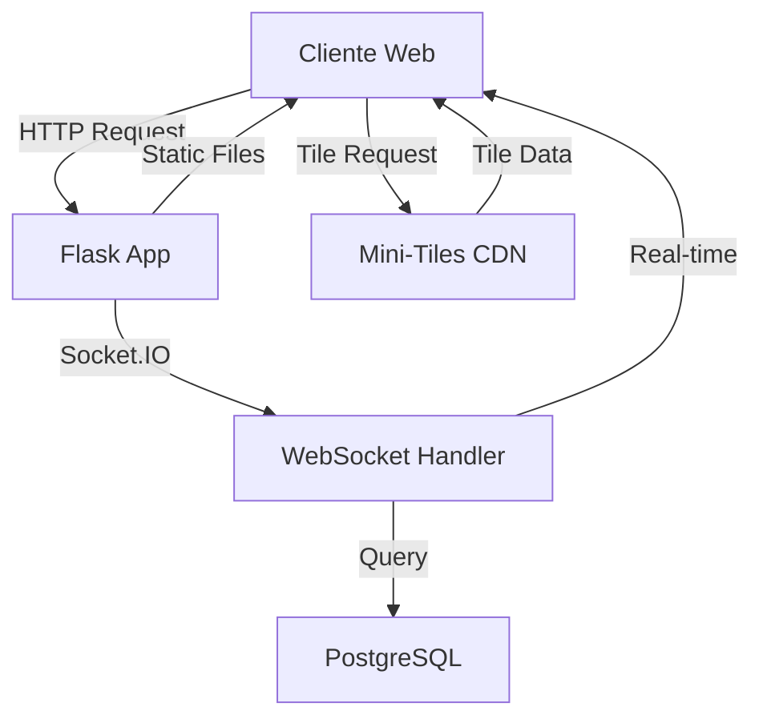
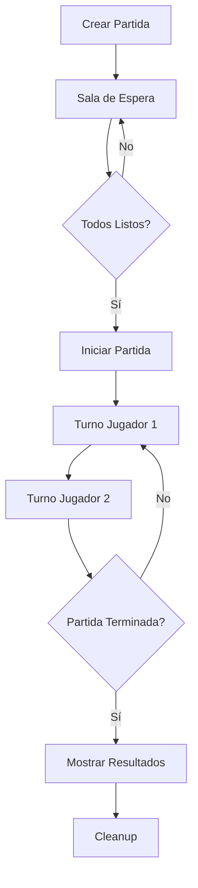

# 🔧 MAIRA - Documentación Técnica Completa

[](https://github.com/Ehr051/MAIRA)
[](https://python.org)
[](https://nodejs.org)
[](https://flask.palletsprojects.com/)
[](https://socket.io)

## 📋 Índice

- [🏗️ Arquitectura del Sistema](#️-arquitectura-del-sistema)
- [🗂️ Estructura de Archivos](#️-estructura-de-archivos) 
- [🔧 Tecnologías y Dependencias](#-tecnologías-y-dependencias)
- [🌐 APIs y Endpoints](#-apis-y-endpoints)
- [🎮 Sistema de Partidas](#-sistema-de-partidas)
- [🗺️ Sistema Mini-Tiles](#️-sistema-mini-tiles)
- [🔌 WebSocket y Tiempo Real](#-websocket-y-tiempo-real)
- [🗄️ Base de Datos](#️-base-de-datos)
- [🛡️ Seguridad](#️-seguridad)
- [⚡ Performance y Optimizaciones](#-performance-y-optimizaciones)
- [🧪 Testing](#-testing)
- [🚀 Deployment](#-deployment)

---

## 🏗️ Arquitectura del Sistema

### 📊 Diagrama de Arquitectura

```
┌─────────────────┐    ┌─────────────────┐    ┌─────────────────┐
│   Frontend      │    │   Backend       │    │   Database      │
│   (Client/)     │◄──►│   (Server/)     │◄──►│   PostgreSQL    │
│                 │    │                 │    │                 │
│ • HTML5         │    │ • Flask 3.0.3   │    │ • Users         │
│ • CSS3          │    │ • Socket.IO     │    │ • Partidas      │
│ • JavaScript    │    │ • Python 3.10+  │    │ • Jugadores     │
│ • Leaflet       │    │ • Gunicorn      │    │ • Chat          │
└─────────────────┘    └─────────────────┘    └─────────────────┘
         │                       │                       │
         │              ┌─────────────────┐              │
         └──────────────►│   Mini-Tiles    │◄─────────────┘
                        │   (GitHub CDN)  │
                        │                 │
                        │ • 97 TAR files  │
                        │ • 9,501 tiles   │
                        │ • JSDelivr CDN  │
                        └─────────────────┘
```

### 🔄 Flujo de Datos



---

## 🗂️ Estructura de Archivos

### 📁 Estructura Completa

```
MAIRA/
├── 📄 README.md                           # Documentación principal
├── 📄 LICENSE                             # Licencia MIT
├── 🌐 app.py                              # Aplicación Flask principal
├── ⚙️ requirements.txt                    # Dependencias Python
├── 📦 package.json                        # Dependencias Node.js
├── 🔧 render.yaml                         # Config deployment Render
├── 🔐 .env.example                        # Template variables entorno
├── 🚫 .gitignore                          # Archivos ignorados por Git
│
├── 📁 Client/                             # 🎨 Frontend completo
│   ├── 📁 css/                            # Estilos CSS
│   │   ├── 🎨 styles.css                  # Estilos principales
│   │   ├── 🎨 partidas.css                # Estilos sistema partidas
│   │   ├── 🎨 miradial.css                # Menú radial contextual
│   │   └── 🎨 responsive.css              # Responsive design
│   │
│   ├── 📁 js/                             # ⚡ Módulos JavaScript
│   │   ├── 🗺️ mapaP.js                    # Sistema de mapas Leaflet
│   │   ├── 🎮 partidas.js                 # Gestión de partidas
│   │   ├── ⚔️ gestionBatalla.js           # Lógica batalla tiempo real
│   │   ├── 🔌 iniciarpartida.js           # Socket.IO y conexiones
│   │   ├── 👤 UserIdentity.js             # Sistema autenticación
│   │   ├── 💬 MAIRAChat.js                # Chat en tiempo real
│   │   ├── 🗻 elevationHandler.js         # Datos elevación
│   │   ├── 🌿 vegetacionhandler.js        # Datos vegetación
│   │   ├── 🎯 simbolosP.js                # Símbolos militares
│   │   ├── 🔧 herramientasP.js            # Herramientas mapa
│   │   ├── 📐 calcosP.js                  # Cálculos geométricos
│   │   ├── ⌨️ atajosP.js                  # Atajos teclado
│   │   └── 🔗 networkConfig.js            # Configuración red
│   │
│   ├── 📁 image/                          # 🖼️ Recursos gráficos
│   │   ├── 🖼️ icons/                      # Iconos interfaz
│   │   ├── 🗺️ markers/                    # Marcadores mapa
│   │   └── 🎖️ military/                   # Símbolos militares
│   │
│   ├── 📁 audio/                          # 🔊 Efectos sonido
│   │   ├── 🔔 notifications/              # Notificaciones
│   │   └── 🎵 ambient/                    # Sonidos ambiente
│   │
│   ├── 📁 Libs/                           # 📚 Librerías externas
│   │   ├── 📦 Leaflet/                    # Leaflet y plugins
│   │   ├── 📊 d3/                         # D3.js para gráficos
│   │   ├── 🔌 socket.io/                  # Socket.IO client
│   │   └── 🎖️ milsymbol/                  # Símbolos militares
│   │
│   └── 📤 uploads/                        # Archivos subidos usuarios
│
├── 🖥️ Server/                             # 🐍 Backend Python
│   ├── 🌐 app.py                          # App Flask principal
│   ├── 🔌 socketio_handlers.py            # Manejadores Socket.IO
│   ├── 🎮 game_manager.py                 # Lógica gestión partidas
│   ├── 🗄️ database.py                     # Conexión base datos
│   ├── 👤 auth.py                         # Sistema autenticación
│   ├── 🛡️ security.py                     # Funciones seguridad
│   └── 🔧 config.py                       # Configuraciones
│
├── 🗂️ static/                             # 📄 Páginas estáticas
│   ├── 🏠 index.html                      # Página principal
│   ├── 🎯 iniciarpartida.html             # Lobby partidas
│   ├── ⚔️ gestionbatalla.html             # Interfaz batalla
│   ├── 🧪 test_integral_maira.html        # Tests completos
│   ├── 🔍 debug_console.html              # Consola debug
│   └── 📊 estado_sistema_maira.html       # Estado sistema
│
├── 🗺️ mini_tiles_github/                  # 🗺️ Sistema mini-tiles
│   ├── 📦 norte_tiles_*.tar               # Tiles región Norte
│   ├── 📦 centro_norte_tiles_*.tar        # Tiles Centro-Norte
│   ├── 📦 centro_tiles_*.tar              # Tiles Centro
│   ├── 📦 patagonia_tiles_*.tar           # Tiles Patagonia
│   └── 📦 sur_tiles_*.tar                 # Tiles Sur
│
├── 📊 indices/                            # 📋 Índices JSON
│   ├── 📄 master_mini_tiles_index.json    # Índice maestro
│   ├── 📄 norte_mini_tiles_index.json     # Índice Norte
│   ├── 📄 centro_norte_mini_tiles_index.json
│   ├── 📄 centro_mini_tiles_index.json
│   ├── 📄 patagonia_mini_tiles_index.json
│   └── 📄 sur_mini_tiles_index.json
│
├── 🔧 scripts/                            # 🐍 Scripts Python
│   ├── ⚙️ app.py                          # Script principal
│   ├── 🏗️ crear_mini_tiles.py             # Generador mini-tiles
│   ├── 🌐 servidor_demo.py                # Servidor desarrollo
│   └── 🧪 test_urls.py                    # Test URLs
│
├── 🛠️ dev-tools/                          # 🧪 Herramientas desarrollo
│   ├── 🧪 test_runner_local.py            # Runner tests
│   ├── 🗄️ test_db_connection.py           # Test base datos
│   ├── 🔍 debug-panel.js                  # Panel debugging
│   └── ✅ verificacion_final.js           # Verificación final
│
├── 📚 docs/                               # 📖 Documentación
│   ├── 📄 README.md                       # Documentación docs
│   ├── 🧪 TESTING_GUIDE.md                # Guía testing
│   ├── 📦 DEPENDENCY_MANAGEMENT.md        # Gestión dependencias
│   ├── 🏗️ SISTEMA_MAIRA_COMPLETO.md       # Sistema completo
│   └── 🔧 SISTEMA_TECNICO_COMPLETO.md     # Este archivo
│
└── 📁 external_storage/                   # 💾 Almacenamiento externo
    └── 🗄️ backup/                         # Backups
```

---

## 🔧 Tecnologías y Dependencias

### 🐍 Backend (Python)

#### Core Framework
```python
Flask==3.0.3                    # Framework web principal
Werkzeug==3.0.4                 # WSGI utility library
Jinja2==3.1.4                   # Template engine
```

#### Real-time Communication
```python
Flask-SocketIO==5.4.1           # WebSocket integration
python-socketio==5.11.4         # Socket.IO server
python-engineio==4.9.1          # Engine.IO server
```

#### Database
```python
psycopg2-binary==2.9.10         # PostgreSQL adapter
PyMySQL==1.0.2                  # MySQL adapter (alternativo)
```

#### Security & Auth
```python
Flask-CORS==3.0.10              # Cross-Origin Resource Sharing
bcrypt==4.2.0                   # Password hashing
python-dotenv==1.0.1            # Environment variables
```

#### Production Server
```python
gunicorn==21.2.0                # WSGI HTTP Server
requests==2.32.3                # HTTP library
```

### 🌐 Frontend (JavaScript/Node.js)

#### Core Libraries
```json
{
  "leaflet": "^1.9.4",                    // Mapping library
  "d3": "^7.8.4",                         // Data visualization
  "socket.io-client": "^4.7.0",           // Real-time client
  "leaflet-draw": "^1.0.4",               // Drawing tools
  "leaflet-measure": "^3.1.0"             // Measurement tools
}
```

#### UI Components
```json
{
  "leaflet-easybutton": "^2.4.0",         // Custom buttons
  "leaflet-sidebar-v2": "^3.2.3",         // Sidebar component
  "leaflet-fullscreen": "^1.0.2",         // Fullscreen control
  "leaflet-search": "^3.0.11"             // Search functionality
}
```

#### Utilities
```json
{
  "html2canvas": "^1.4.1",                // Screenshots
  "jspdf": "^2.5.1",                      // PDF generation
  "file-saver": "^2.0.5",                 // File downloading
  "mgrs": "^1.0.0"                        // Military grid reference
}
```

---

## 🌐 APIs y Endpoints

### 🔌 Endpoints REST

#### 👤 Autenticación
```python
POST   /api/auth/login           # Iniciar sesión
POST   /api/auth/register        # Registrar usuario
POST   /api/auth/logout          # Cerrar sesión
GET    /api/auth/verify          # Verificar token
POST   /api/auth/refresh         # Refrescar token
```

#### 🎮 Gestión de Partidas
```python
POST   /api/partidas/crear       # Crear nueva partida
POST   /api/partidas/unirse      # Unirse a partida existente
GET    /api/partidas/lista       # Listar partidas disponibles
DELETE /api/partidas/{id}        # Eliminar partida
PUT    /api/partidas/{id}/config # Actualizar configuración
```

#### 🗺️ Sistema de Tiles
```python
GET    /api/tiles/{provincia}/{x}/{y}/{z}     # Obtener tile específico
GET    /api/indices/{provincia}               # Índice provincial
GET    /mini_tiles_github/{archivo}.tar       # Descargar TAR completo
GET    /api/elevation/{lat}/{lng}             # Datos elevación punto
GET    /api/vegetation/{lat}/{lng}            # Datos vegetación punto
```

#### 👥 Gestión de Usuarios
```python
GET    /api/users/profile        # Perfil usuario actual
PUT    /api/users/profile        # Actualizar perfil
GET    /api/users/friends        # Lista de amigos
POST   /api/users/friends/add    # Agregar amigo
```

#### 📊 Sistema y Monitoreo
```python
GET    /health                   # Health check
GET    /api/status               # Estado detallado sistema
GET    /api/metrics              # Métricas performance
GET    /api/logs                 # Logs sistema (admin)
```

### 🔌 Eventos WebSocket

#### 🎮 Eventos de Partida
```javascript
// Cliente → Servidor
socket.emit('crearPartida', {configuracion})
socket.emit('unirseAPartida', {codigo, userId, userName})
socket.emit('salirPartida', {codigo})
socket.emit('iniciarPartida', {codigo})

// Servidor → Cliente
socket.on('partidaCreada', (partida))
socket.on('unionExitosa', (datosPartida))
socket.on('partidaIniciada', (datosPartida))
socket.on('jugadorSalio', (jugadorId))
```

#### 💬 Chat en Tiempo Real
```javascript
// Cliente → Servidor
socket.emit('enviarMensaje', {mensaje, destinatario, sala})
socket.emit('unirseASala', {sala})

// Servidor → Cliente
socket.on('mensajeRecibido', (mensaje))
socket.on('usuarioConectado', (usuario))
socket.on('usuarioDesconectado', (usuario))
```

#### ⚔️ Eventos de Batalla
```javascript
// Cliente → Servidor
socket.emit('moverElemento', {elementoId, posicion})
socket.emit('atacar', {atacante, objetivo})
socket.emit('terminarTurno', {userId})

// Servidor → Cliente
socket.on('elementoMovido', (elemento))
socket.on('ataqueRealizado', (resultado))
socket.on('turnoActualizado', (nuevoTurno))
```

---

## 🎮 Sistema de Partidas

### 🏗️ Arquitectura de Partidas

```python
class PartidaManager:
    def __init__(self):
        self.partidas_activas = {}
        self.usuarios_conectados = {}
        
    def crear_partida(self, configuracion):
        """Crear nueva partida con configuración específica"""
        
    def unirse_a_partida(self, codigo, usuario):
        """Unir usuario a partida existente"""
        
    def iniciar_partida(self, codigo):
        """Iniciar partida cuando todos listos"""
        
    def terminar_partida(self, codigo, razon):
        """Terminar partida y cleanup"""
```

### 📊 Estados de Partida

```python
ESTADOS_PARTIDA = {
    'esperando': 'Esperando jugadores',
    'configurando': 'Configurando equipos',
    'iniciada': 'Partida en curso',
    'pausada': 'Partida pausada',
    'terminada': 'Partida finalizada',
    'cancelada': 'Partida cancelada'
}
```

### ⚙️ Configuración de Partida

```python
class ConfiguracionPartida:
    def __init__(self):
        self.nombre = ""                    # Nombre de la partida
        self.duracion_partida = 30          # Minutos
        self.duracion_turno = 5             # Minutos por turno
        self.max_jugadores = 8              # Máximo jugadores
        self.modo = "online"                # local | online
        self.objetivo = ""                  # Objetivo de la partida
        self.mapa_inicial = "centro"        # Región inicial
        self.visibilidad = "publica"        # publica | privada
```

### 🎯 Flujo de Partida



---

## 🗺️ Sistema Mini-Tiles

### 🏗️ Arquitectura Mini-Tiles

El sistema mini-tiles v3.0 optimiza la distribución de mapas:

```python
class MiniTilesLoader:
    def __init__(self):
        self.base_urls = [
            'https://github.com/Ehr051/MAIRA/releases/download/tiles-v3.0/',
            'https://cdn.jsdelivr.net/gh/Ehr051/MAIRA@tiles-v3.0/',
            'http://localhost:8000/'
        ]
        self.cache = {}
        self.indices = {}
```

### 📊 Especificaciones Técnicas

```yaml
Sistema Mini-Tiles v3.0:
  total_archivos: 97
  tamano_maximo: 1.15MB por archivo
  total_tiles: 9501
  resolucion: 25km × 25km por tile
  formato: TAR con JSON + PNG
  compresion: ~99% vs archivos originales
  distribucion: GitHub Releases + JSDelivr CDN
```

### 🗺️ División Regional

```python
REGIONES = {
    'norte': {
        'archivos': 15,
        'provincias': ['Jujuy', 'Salta', 'Formosa', 'Chaco'],
        'tiles': 1847
    },
    'centro_norte': {
        'archivos': 20, 
        'provincias': ['Tucumán', 'Santiago del Estero', 'Catamarca'],
        'tiles': 2156
    },
    'centro': {
        'archivos': 25,
        'provincias': ['Córdoba', 'Santa Fe', 'Buenos Aires'],
        'tiles': 2634
    },
    'patagonia': {
        'archivos': 20,
        'provincias': ['La Pampa', 'Neuquén', 'Río Negro'],
        'tiles': 1891
    },
    'sur': {
        'archivos': 17,
        'provincias': ['Chubut', 'Santa Cruz', 'Tierra del Fuego'],
        'tiles': 1973
    }
}
```

### 🔄 Algoritmo de Carga

```javascript
async function cargarTile(provincia, x, y, z) {
    // 1. Verificar cache local
    const cacheKey = `${provincia}_${x}_${y}_${z}`;
    if (this.cache[cacheKey]) {
        return this.cache[cacheKey];
    }
    
    // 2. Buscar en índice provincial
    const indice = await this.getIndiceProvincial(provincia);
    const tileInfo = indice.tiles[cacheKey];
    
    if (!tileInfo) {
        throw new Error(`Tile no encontrado: ${cacheKey}`);
    }
    
    // 3. Cargar archivo TAR correspondiente
    const tarData = await this.loadTarFile(tileInfo.archivo);
    
    // 4. Extraer tile específico del TAR
    const tileData = this.extractTileFromTar(tarData, tileInfo.offset);
    
    // 5. Cachear resultado
    this.cache[cacheKey] = tileData;
    
    return tileData;
}
```

---

## 🔌 WebSocket y Tiempo Real

### 🏗️ Configuración Socket.IO

```python
# Configuración optimizada para Render.com
socketio = SocketIO(
    app,
    cors_allowed_origins="*",
    transports=['polling'],          # Solo polling para estabilidad
    ping_timeout=120,               # Timeout extendido
    ping_interval=25,               # Ping cada 25s
    allow_unsafe_werkzeug=True,     # Requerido para Render
    logger=True,                    # Logs detallados
    engineio_logger=True            # Logs engine
)
```

### 🔄 Gestión de Conexiones

```python
@socketio.on('connect')
def handle_connect(auth):
    """Manejar nueva conexión de cliente"""
    print(f'Cliente conectado: {request.sid}')
    
    # Verificar autenticación
    if not verify_auth_token(auth):
        return False
    
    # Agregar a usuarios conectados
    usuarios_conectados[request.sid] = {
        'user_id': auth['user_id'],
        'username': auth['username'],
        'connected_at': datetime.now(),
        'last_ping': datetime.now()
    }
    
    # Notificar a otros usuarios
    emit('usuario_conectado', {
        'username': auth['username']
    }, broadcast=True, skip_sid=request.sid)

@socketio.on('disconnect')
def handle_disconnect():
    """Manejar desconexión de cliente"""
    user_info = usuarios_conectados.pop(request.sid, None)
    
    if user_info:
        # Limpiar partidas si estaba jugando
        cleanup_user_from_games(user_info['user_id'])
        
        # Notificar desconexión
        emit('usuario_desconectado', {
            'username': user_info['username']
        }, broadcast=True)
```

### 📡 Eventos en Tiempo Real

```python
# Eventos de partida
@socketio.on('crearPartida')
def handle_crear_partida(data):
    """Crear nueva partida multijugador"""
    
@socketio.on('unirseAPartida') 
def handle_unirse_partida(data):
    """Unirse a partida existente"""
    
@socketio.on('salirPartida')
def handle_salir_partida(data):
    """Salir de partida actual"""

# Eventos de batalla
@socketio.on('moverElemento')
def handle_mover_elemento(data):
    """Mover elemento en el mapa"""
    
@socketio.on('atacar')
def handle_atacar(data):
    """Realizar ataque entre elementos"""

# Eventos de chat
@socketio.on('enviarMensaje')
def handle_enviar_mensaje(data):
    """Enviar mensaje a chat de partida"""
```

---

## 🗄️ Base de Datos

### 📊 Schema PostgreSQL

```sql
-- Tabla de usuarios
CREATE TABLE users (
    id SERIAL PRIMARY KEY,
    username VARCHAR(50) UNIQUE NOT NULL,
    email VARCHAR(100) UNIQUE NOT NULL,
    password_hash VARCHAR(255) NOT NULL,
    created_at TIMESTAMP DEFAULT CURRENT_TIMESTAMP,
    last_login TIMESTAMP,
    is_active BOOLEAN DEFAULT TRUE,
    avatar_url VARCHAR(255),
    nivel INTEGER DEFAULT 1,
    experiencia INTEGER DEFAULT 0
);

-- Tabla de partidas
CREATE TABLE partidas (
    id SERIAL PRIMARY KEY,
    codigo VARCHAR(10) UNIQUE NOT NULL,
    nombre VARCHAR(100) NOT NULL,
    creador_id INTEGER REFERENCES users(id),
    configuracion JSONB NOT NULL,
    estado VARCHAR(20) DEFAULT 'esperando',
    max_jugadores INTEGER DEFAULT 8,
    fecha_creacion TIMESTAMP DEFAULT CURRENT_TIMESTAMP,
    fecha_inicio TIMESTAMP,
    fecha_fin TIMESTAMP,
    ganador_id INTEGER REFERENCES users(id),
    duracion_minutos INTEGER
);

-- Tabla de jugadores en partidas
CREATE TABLE partida_jugadores (
    id SERIAL PRIMARY KEY,
    partida_id INTEGER REFERENCES partidas(id) ON DELETE CASCADE,
    user_id INTEGER REFERENCES users(id),
    equipo VARCHAR(20) NOT NULL,
    posicion INTEGER NOT NULL,
    estado VARCHAR(20) DEFAULT 'esperando',
    puntuacion INTEGER DEFAULT 0,
    fecha_union TIMESTAMP DEFAULT CURRENT_TIMESTAMP,
    UNIQUE(partida_id, user_id)
);

-- Tabla de mensajes de chat
CREATE TABLE chat_mensajes (
    id SERIAL PRIMARY KEY,
    partida_id INTEGER REFERENCES partidas(id) ON DELETE CASCADE,
    user_id INTEGER REFERENCES users(id),
    mensaje TEXT NOT NULL,
    tipo VARCHAR(20) DEFAULT 'mensaje',
    timestamp TIMESTAMP DEFAULT CURRENT_TIMESTAMP,
    es_sistema BOOLEAN DEFAULT FALSE
);

-- Tabla de elementos en el mapa
CREATE TABLE elementos_mapa (
    id SERIAL PRIMARY KEY,
    partida_id INTEGER REFERENCES partidas(id) ON DELETE CASCADE,
    tipo VARCHAR(50) NOT NULL,
    propietario_id INTEGER REFERENCES users(id),
    posicion_lat DECIMAL(10, 7) NOT NULL,
    posicion_lng DECIMAL(10, 7) NOT NULL,
    propiedades JSONB,
    estado VARCHAR(20) DEFAULT 'activo',
    creado_en TIMESTAMP DEFAULT CURRENT_TIMESTAMP,
    actualizado_en TIMESTAMP DEFAULT CURRENT_TIMESTAMP
);

-- Índices para performance
CREATE INDEX idx_partidas_codigo ON partidas(codigo);
CREATE INDEX idx_partidas_estado ON partidas(estado);
CREATE INDEX idx_partida_jugadores_partida ON partida_jugadores(partida_id);
CREATE INDEX idx_chat_mensajes_partida ON chat_mensajes(partida_id);
CREATE INDEX idx_elementos_mapa_partida ON elementos_mapa(partida_id);
```

### 🔗 Conexión y Pool

```python
import psycopg2
from psycopg2 import pool

class DatabaseManager:
    def __init__(self, database_url, min_conn=1, max_conn=20):
        self.connection_pool = psycopg2.pool.ThreadedConnectionPool(
            min_conn,
            max_conn,
            database_url
        )
    
    def get_connection(self):
        """Obtener conexión del pool"""
        return self.connection_pool.getconn()
    
    def return_connection(self, conn):
        """Retornar conexión al pool"""
        self.connection_pool.putconn(conn)
    
    def execute_query(self, query, params=None):
        """Ejecutar query con manejo automático de conexiones"""
        conn = self.get_connection()
        try:
            with conn.cursor() as cursor:
                cursor.execute(query, params)
                if query.strip().upper().startswith('SELECT'):
                    return cursor.fetchall()
                else:
                    conn.commit()
                    return cursor.rowcount
        finally:
            self.return_connection(conn)
```

### 🧪 Migraciones

```python
# Script de migración automática
def run_migrations():
    """Ejecutar migraciones de base de datos"""
    migrations = [
        '001_create_users_table.sql',
        '002_create_partidas_table.sql',
        '003_create_partida_jugadores_table.sql',
        '004_create_chat_mensajes_table.sql',
        '005_create_elementos_mapa_table.sql',
        '006_add_indices.sql'
    ]
    
    for migration in migrations:
        execute_migration_file(migration)
```

---

## 🛡️ Seguridad

### 🔐 Autenticación JWT

```python
import jwt
from datetime import datetime, timedelta

class AuthManager:
    def __init__(self, secret_key):
        self.secret_key = secret_key
        self.algorithm = 'HS256'
        self.expiration_delta = timedelta(hours=24)
    
    def generate_token(self, user_id, username):
        """Generar token JWT para usuario"""
        payload = {
            'user_id': user_id,
            'username': username,
            'exp': datetime.utcnow() + self.expiration_delta,
            'iat': datetime.utcnow()
        }
        return jwt.encode(payload, self.secret_key, algorithm=self.algorithm)
    
    def verify_token(self, token):
        """Verificar y decodificar token JWT"""
        try:
            payload = jwt.decode(token, self.secret_key, algorithms=[self.algorithm])
            return payload
        except jwt.ExpiredSignatureError:
            raise AuthError('Token expirado')
        except jwt.InvalidTokenError:
            raise AuthError('Token inválido')
```

### 🔒 Hashing de Contraseñas

```python
import bcrypt

def hash_password(password):
    """Hash seguro de contraseña con bcrypt"""
    salt = bcrypt.gensalt()
    return bcrypt.hashpw(password.encode('utf-8'), salt)

def verify_password(password, hashed):
    """Verificar contraseña contra hash"""
    return bcrypt.checkpw(password.encode('utf-8'), hashed)
```

### 🛡️ CORS y Headers de Seguridad

```python
from flask_cors import CORS

# Configuración CORS restrictiva para producción
CORS(app, 
    origins=[
        "https://maira-3e76.onrender.com",
        "https://*.onrender.com" 
    ],
    allow_headers=["Content-Type", "Authorization"],
    methods=["GET", "POST", "PUT", "DELETE"],
    supports_credentials=True
)

# Headers de seguridad
@app.after_request
def after_request(response):
    response.headers['X-Content-Type-Options'] = 'nosniff'
    response.headers['X-Frame-Options'] = 'DENY'
    response.headers['X-XSS-Protection'] = '1; mode=block'
    response.headers['Strict-Transport-Security'] = 'max-age=31536000; includeSubDomains'
    return response
```

### 🚫 Rate Limiting

```python
from flask_limiter import Limiter
from flask_limiter.util import get_remote_address

limiter = Limiter(
    app,
    key_func=get_remote_address,
    default_limits=["1000 per hour"]
)

@app.route('/api/auth/login', methods=['POST'])
@limiter.limit("5 per minute")
def login():
    """Endpoint de login con rate limiting"""
    pass
```

---

## ⚡ Performance y Optimizaciones

### 🔄 Caching Sistema

```python
from functools import lru_cache
import redis

# Cache en memoria con LRU
@lru_cache(maxsize=1000)
def get_tile_data(provincia, x, y, z):
    """Cache de tiles en memoria"""
    return load_tile_from_storage(provincia, x, y, z)

# Cache Redis para datos compartidos
redis_client = redis.Redis(host='localhost', port=6379, db=0)

def cache_partida_data(partida_id, data):
    """Cachear datos de partida en Redis"""
    redis_client.setex(
        f"partida:{partida_id}", 
        3600,  # 1 hora TTL
        json.dumps(data)
    )
```

### 📊 Compresión de Datos

```python
import gzip
import json

def compress_tile_data(data):
    """Comprimir datos de tile antes de enviar"""
    json_data = json.dumps(data).encode('utf-8')
    return gzip.compress(json_data)

def decompress_tile_data(compressed_data):
    """Descomprimir datos de tile"""
    json_data = gzip.decompress(compressed_data)
    return json.loads(json_data.decode('utf-8'))
```

### ⚡ Optimizaciones Frontend

```javascript
// Lazy loading de módulos
const loadModule = async (moduleName) => {
    const module = await import(`./modules/${moduleName}.js`);
    return module.default;
};

// Debouncing para eventos frecuentes
function debounce(func, wait) {
    let timeout;
    return function executedFunction(...args) {
        const later = () => {
            clearTimeout(timeout);
            func(...args);
        };
        clearTimeout(timeout);
        timeout = setTimeout(later, wait);
    };
}

// Virtual scrolling para listas grandes
class VirtualScrollList {
    constructor(container, itemHeight, items) {
        this.container = container;
        this.itemHeight = itemHeight;
        this.items = items;
        this.visibleStart = 0;
        this.visibleEnd = 0;
        this.init();
    }
    
    init() {
        this.container.addEventListener('scroll', 
            debounce(() => this.updateVisibleItems(), 16)
        );
    }
}
```

---

## 🧪 Testing

### 🧪 Estructura de Tests

```
dev-tools/
├── 🧪 test_runner_local.py           # Runner principal
├── 🗄️ test_db_connection.py          # Tests base datos
├── 🌐 test_api_endpoints.py          # Tests APIs
├── 🔌 test_socketio.py               # Tests WebSocket
├── 🗺️ test_mini_tiles.py             # Tests sistema tiles
├── 🎮 test_game_logic.py             # Tests lógica juego
└── 📊 test_performance.py            # Tests performance
```

### 🧪 Tests Unitarios

```python
import unittest
from unittest.mock import patch, MagicMock

class TestPartidaManager(unittest.TestCase):
    def setUp(self):
        self.partida_manager = PartidaManager()
    
    def test_crear_partida(self):
        """Test crear partida nueva"""
        config = {
            'nombre': 'Test Partida',
            'duracion': 30,
            'max_jugadores': 4
        }
        
        partida = self.partida_manager.crear_partida(config)
        
        self.assertIsNotNone(partida)
        self.assertEqual(partida['nombre'], 'Test Partida')
        self.assertEqual(partida['estado'], 'esperando')
    
    def test_unirse_partida(self):
        """Test unirse a partida existente"""
        # Crear partida
        partida = self.partida_manager.crear_partida({
            'nombre': 'Test',
            'max_jugadores': 4
        })
        
        # Unir usuario
        usuario = {'id': 1, 'username': 'test_user'}
        resultado = self.partida_manager.unirse_a_partida(
            partida['codigo'], 
            usuario
        )
        
        self.assertTrue(resultado['exito'])
        self.assertIn(usuario, partida['jugadores'])
```

### 🧪 Tests de Integración

```python
import pytest
import requests
from socketio import SimpleClient

class TestIntegracion:
    def setup_method(self):
        self.base_url = 'http://localhost:5000'
        self.client = SimpleClient()
    
    def test_flujo_completo_partida(self):
        """Test flujo completo crear → unirse → jugar"""
        
        # 1. Registrar usuario
        response = requests.post(f'{self.base_url}/api/auth/register', json={
            'username': 'test_user',
            'email': 'test@example.com',
            'password': 'test123'
        })
        assert response.status_code == 201
        
        # 2. Login
        response = requests.post(f'{self.base_url}/api/auth/login', json={
            'username': 'test_user',
            'password': 'test123'
        })
        token = response.json()['token']
        
        # 3. Conectar Socket.IO
        self.client.connect(f'{self.base_url}', auth={'token': token})
        
        # 4. Crear partida
        self.client.emit('crearPartida', {
            'configuracion': {
                'nombre': 'Test Integration',
                'duracion': 30
            }
        })
        
        # 5. Verificar partida creada
        response = self.client.receive()
        assert response[0] == 'partidaCreada'
        partida = response[1]
        assert partida['nombre'] == 'Test Integration'
```

### 📊 Tests de Performance

```python
import time
import asyncio
from concurrent.futures import ThreadPoolExecutor

class TestPerformance:
    def test_carga_simultanea_tiles(self):
        """Test carga simultánea de múltiples tiles"""
        
        def cargar_tile(coords):
            start_time = time.time()
            tile_data = load_tile(*coords)
            end_time = time.time()
            return end_time - start_time
        
        # Coordenadas de tiles a cargar
        coordenadas = [
            ('centro', 1234, 5678, 12),
            ('norte', 2345, 6789, 12),
            ('sur', 3456, 7890, 12)
        ]
        
        # Cargar en paralelo
        with ThreadPoolExecutor(max_workers=10) as executor:
            tiempos = list(executor.map(cargar_tile, coordenadas))
        
        # Verificar performance
        tiempo_promedio = sum(tiempos) / len(tiempos)
        assert tiempo_promedio < 2.0  # Menos de 2 segundos
        assert max(tiempos) < 5.0     # Ninguno más de 5 segundos
    
    def test_socketio_concurrencia(self):
        """Test múltiples conexiones Socket.IO simultáneas"""
        
        async def conectar_cliente():
            client = SimpleClient()
            start_time = time.time()
            client.connect('http://localhost:5000')
            end_time = time.time()
            client.disconnect()
            return end_time - start_time
        
        # 100 conexiones simultáneas
        async def test_concurrencia():
            tasks = [conectar_cliente() for _ in range(100)]
            tiempos = await asyncio.gather(*tasks)
            return tiempos
        
        tiempos = asyncio.run(test_concurrencia())
        tiempo_promedio = sum(tiempos) / len(tiempos)
        
        assert tiempo_promedio < 1.0  # Conexión promedio < 1 segundo
        assert len([t for t in tiempos if t < 2.0]) >= 95  # 95% < 2 segundos
```

---

## 🚀 Deployment

### 🔧 Configuración Render.com

```yaml
# render.yaml
services:
  - type: web
    name: maira-server
    env: python
    plan: free
    buildCommand: pip install -r requirements.txt
    startCommand: python app.py
    envVars:
      - key: PYTHON_VERSION
        value: 3.10.6
      - key: PORT
        value: 10000
    
databases:
  - name: maira-db
    databaseName: maira
    user: maira_user
    plan: free
```

### 🔄 CI/CD Pipeline

```bash
# .github/workflows/deploy.yml
name: Deploy to Render

on:
  push:
    branches: [ main ]

jobs:
  test:
    runs-on: ubuntu-latest
    steps:
    - uses: actions/checkout@v2
    - name: Set up Python
      uses: actions/setup-python@v2
      with:
        python-version: 3.10
    
    - name: Install dependencies
      run: |
        pip install -r requirements.txt
    
    - name: Run tests
      run: |
        python -m pytest dev-tools/
    
  deploy:
    needs: test
    runs-on: ubuntu-latest
    if: github.ref == 'refs/heads/main'
    steps:
    - name: Deploy to Render
      run: |
        # Render auto-deploys on git push
        echo "Deployment triggered automatically"
```

### 📊 Monitoreo Post-Deploy

```python
# Health check endpoint
@app.route('/health')
def health_check():
    """Endpoint para verificar estado del sistema"""
    try:
        # Verificar base de datos
        db_status = check_database_connection()
        
        # Verificar Socket.IO
        socketio_status = len(usuarios_conectados) >= 0
        
        # Verificar sistema de tiles
        tiles_status = test_tile_loading()
        
        return jsonify({
            'status': 'healthy' if all([db_status, socketio_status, tiles_status]) else 'unhealthy',
            'timestamp': datetime.now().isoformat(),
            'services': {
                'database': 'up' if db_status else 'down',
                'socketio': 'up' if socketio_status else 'down',
                'tiles': 'up' if tiles_status else 'down'
            },
            'metrics': {
                'usuarios_conectados': len(usuarios_conectados),
                'partidas_activas': len(partidas_activas),
                'uptime': get_uptime()
            }
        })
    except Exception as e:
        return jsonify({
            'status': 'error',
            'error': str(e)
        }), 500
```

### 🔍 Logging y Monitoreo

```python
import logging
from pythonjsonlogger import jsonlogger

# Configurar logging estructurado
def setup_logging():
    logHandler = logging.StreamHandler()
    formatter = jsonlogger.JsonFormatter()
    logHandler.setFormatter(formatter)
    logger = logging.getLogger()
    logger.addHandler(logHandler)
    logger.setLevel(logging.INFO)

# Middleware para logging de requests
@app.before_request
def log_request_info():
    logger.info('Request received', extra={
        'method': request.method,
        'url': request.url,
        'remote_addr': request.remote_addr,
        'user_agent': request.headers.get('User-Agent')
    })

# Logging de eventos Socket.IO
@socketio.on_error_default
def default_error_handler(e):
    logger.error('Socket.IO error', extra={
        'error': str(e),
        'session_id': request.sid,
        'namespace': request.namespace
    })
```

---

## 📈 Métricas y Analytics

### 📊 Dashboard de Métricas

```javascript
// Métricas en tiempo real para dashboard
class MetricsCollector {
    constructor() {
        this.metrics = {
            requests_per_second: 0,
            active_connections: 0,
            average_response_time: 0,
            tiles_loaded: 0,
            errors_count: 0
        };
        this.startCollection();
    }
    
    startCollection() {
        setInterval(() => {
            this.collectMetrics();
            this.sendToAnalytics();
        }, 10000); // Cada 10 segundos
    }
    
    collectMetrics() {
        // Recolectar métricas del cliente
        this.metrics.tiles_loaded = this.countLoadedTiles();
        this.metrics.performance = this.getPerformanceMetrics();
    }
}
```

---

**📄 Documentación Técnica Completa - MAIRA v3.0**  
**👨‍💻 Autor**: MAIRA Development Team  
**📅 Última actualización**: Agosto 2025  
**🔗 Repositorio**: [https://github.com/Ehr051/MAIRA](https://github.com/Ehr051/MAIRA)
